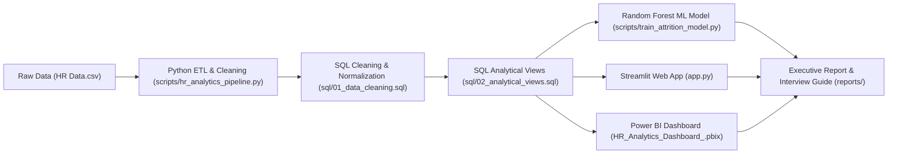

# HR Analytics & Employee Attrition Intelligence System

An enterprise-grade Data Science, Analytics & Business Intelligence system designed to analyze employee turnover, predict attrition risk using Machine Learning, and deliver actionable retention strategies for HR leadership.

---

## 📌 Project Highlights & Key Features

- **Automated Data Pipeline:** Python ETL (`scripts/hr_analytics_pipeline.py`) for data validation and statistical audits.
- **SQL Data Warehouse & Engineering:** T-SQL scripts (`sql/`) utilizing CTEs (`ROW_NUMBER`), 6 modular analytical views, and `NTILE(4)` income quartile window functions.
- **Predictive Machine Learning Model:** Random Forest Classifier (`scripts/train_attrition_model.py`) achieving **0.8127 ROC-AUC** score to rank top predictive turnover drivers.
- **Interactive Web App & Dashboard:** Streamlit interactive web application (`app.py`) with dynamic Plotly visualizations and Power BI reporting (`.pbix`).
- **Executive Reporting & Interview Guide:** Full business insights report (`reports/HR_Attrition_Executive_Report.md`) and STAR-method interview preparation guide (`reports/Interview_Preparation_Guide.md`).

---

## 📈 Key Metrics & Findings

- **Total Headcount Analyzed:** 1,470 Employees
- **Overall Turnover Rate:** **16.12%** (237 departures)
- **Top Predictive Attrition Drivers (ML Feature Importance):**
  1. Age (`0.0759`)
  2. Monthly Income (`0.0684`)
  3. Overtime Work (`0.0624`) - Overtime staff exhibit **30.53% attrition** (3x non-overtime rate)
  4. Total Working Years (`0.0568`)
  5. Distance From Home (`0.0414`)

---

## 🏗️ Architecture & Data Pipeline



---

## 🛠️ Tech Stack & Skills Demonstrated

- **Machine Learning & Python:** `scikit-learn` (Random Forest, ROC-AUC `0.8127`), `pandas`, `numpy`, `plotly`, `streamlit`.
- **SQL / T-SQL:** Window functions (`NTILE`, `ROW_NUMBER`, `DENSE_RANK`), CTEs, modular View creation, Data Deduplication.
- **Power BI & DAX:** Multi-page interactive reports, DAX calculated measures (`CALCULATE`, `DIVIDE`, `FILTER`).
- **Business Intelligence & Reporting:** Executive narrative writing, retention risk scoring, STAR interview framework.

---

## 📂 Directory Structure

```
HR_Dashboard/
├── app.py                                   # Streamlit interactive web dashboard application
├── HR Data.csv                              # IBM HR Analytics Dataset (1,470 records)
├── HR_Analytics_Dashboard_.pbix             # Interactive Power BI Dashboard
├── README.md                                # Project Documentation & Architecture
├── sql/
│   ├── 01_data_cleaning.sql                 # Data cleaning & CTE deduplication
│   ├── 02_analytical_views.sql              # Modular SQL views for reporting
│   └── 03_advanced_queries.sql              # NTILE quartiles & advanced window functions
├── scripts/
│   ├── hr_analytics_pipeline.py             # Python ETL, data audit & summary pipeline
│   └── train_attrition_model.py             # Random Forest ML Attrition Prediction model
└── reports/
    ├── DAX_Measures_Reference.md             # DAX formulas reference guide
    ├── HR_Attrition_Executive_Report.md        # Executive findings & business recommendations
    ├── Interview_Preparation_Guide.md       # STAR-method interview talking points & FAQs
    ├── ml_feature_importances.csv           # ML model feature importance rankings
    └── python_eda_summary.csv               # Automated Python statistical export
```

---

## 🚀 How to Run & Reproduce

### 1. Launch Interactive Streamlit Web App
```bash
streamlit run app.py
```

### 2. Train Machine Learning Model
```bash
python scripts/train_attrition_model.py
```

### 3. Run Python Data Pipeline
```bash
python scripts/hr_analytics_pipeline.py
```

---

## 📄 License & Attribution
Dataset based on IBM HR Analytics Employee Attrition data. Built and engineered for enterprise portfolio presentation.
