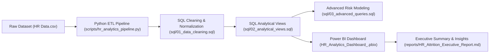

# HR Analytics & Employee Attrition Intelligence Dashboard

An end-to-end Data Analytics & Business Intelligence project designed to analyze employee turnover, identify key workforce attrition drivers, and deliver actionable insights for enterprise HR management.

---

## 📌 Project Overview

Employee attrition poses significant costs to organizations in recruitment, onboarding, and productivity loss. This project delivers an end-to-end workforce analytics pipeline—spanning data cleaning, advanced SQL querying, Python automated ETL, DAX calculated measures, and interactive Power BI visual dashboards.

### Key Performance Indicators (KPIs)
- **Total Headcount Analyzed:** 1,470 Employees
- **Overall Attrition Rate:** **16.12%** (237 departures)
- **Top Attrition Driver:** **Overtime Work** (30.53% Attrition vs. 10.44% Non-Overtime)
- **Highest Turnover Department:** **Sales** (20.63% Attrition Rate)

---

## 🏗️ Architecture & Data Pipeline



---

## 🛠️ Tech Stack & Skills Demonstrated

- **SQL / T-SQL:** Window functions (`NTILE`, `ROW_NUMBER`, `DENSE_RANK`), CTEs, View Creation, Data Cleaning, Indexing, Data Normalization.
- **Python (Pandas / NumPy):** Automated ETL pipeline, Data Quality auditing, Risk Scoring model, Summary statistics export.
- **Power BI & DAX:** Multi-page interactive dashboard, dynamic filters, custom DAX measures (`DIVIDE`, `CALCULATE`, `FILTER`).
- **Data Visualization & Storytelling:** Executive reporting, KPI tracking, demographic breakdown, compensation benchmark analysis.

---

## 📂 Project Structure

```
HR_Dashboard/
├── HR Data.csv                              # Raw IBM HR Analytics Dataset (1,470 records)
├── HR_Analytics_Dashboard_.pbix             # Interactive Power BI Dashboard
├── README.md                                # Project Documentation & Setup Guide
├── sql/
│   ├── 01_data_cleaning.sql                 # Data cleaning, deduplication & standardization
│   ├── 02_analytical_views.sql              # Modular SQL views for reporting & Power BI
│   └── 03_advanced_queries.sql              # Advanced queries (Quartiles, CTEs, Risk Scoring)
├── scripts/
│   └── hr_analytics_pipeline.py             # Python ETL, data audit & automated EDA pipeline
└── reports/
    ├── DAX_Measures_Reference.md             # Detailed DAX formulas reference guide
    ├── HR_Attrition_Executive_Report.md        # Business insights & retention recommendations
    └── python_eda_summary.csv               # Automated Python summary export
```

---

## 📊 Key Insights & Business Recommendations

### 1. Overtime vs. Attrition Impact
Employees working overtime exhibit a **30.53% attrition rate**, which is nearly **3 times higher** than employees who do not work overtime (**10.44%**).

### 2. Departmental Breakdown
- **Sales:** 20.63% Attrition Rate
- **Human Resources:** 19.05% Attrition Rate
- **Research & Development:** 13.84% Attrition Rate

### 3. Recommendations for HR Leadership
1. **Workload Redistribution:** Implement overtime caps and workload audits in Sales and R&D.
2. **Targeted Sales Retention:** Re-evaluate sales incentive structures and career growth pathways.
3. **Proactive Risk Scoring:** Deploy the 4-factor retention risk model to identify high-risk employees before exit decisions occur.

---

## 🚀 How to Run & Reproduce

### 1. Execute Python Pipeline
```bash
python scripts/hr_analytics_pipeline.py
```

### 2. Execute SQL Scripts
Load `HR Data.csv` into MS SQL Server, MySQL, or PostgreSQL, then run scripts in order:
1. `sql/01_data_cleaning.sql`
2. `sql/02_analytical_views.sql`
3. `sql/03_advanced_queries.sql`

### 3. Explore Power BI Dashboard
Open `HR_Analytics_Dashboard_.pbix` in Power BI Desktop to interact with the visualizations and dynamic DAX slicers.

---

## 📄 License & Attribution
Dataset based on IBM HR Analytics Employee Attrition data. Project engineered & enhanced for enterprise portfolio visualization.

